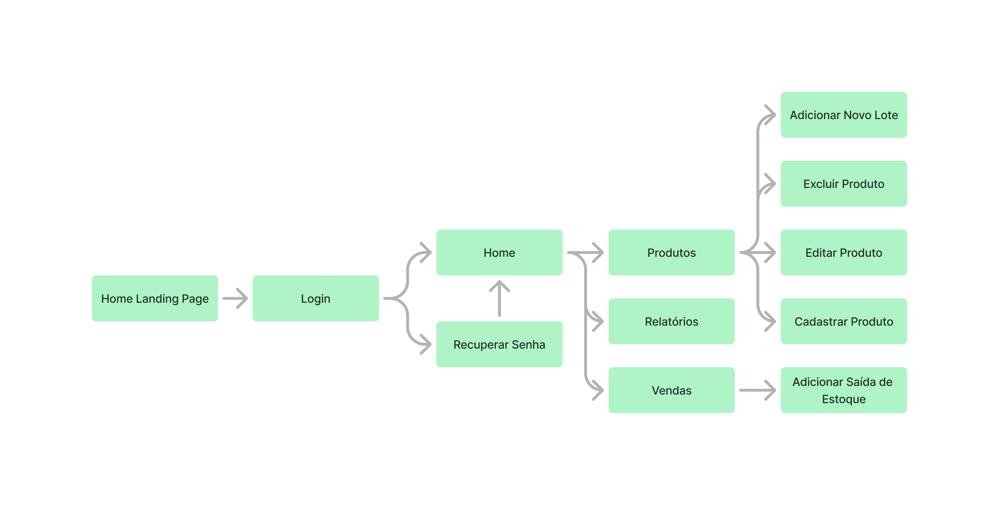

# Trackventory versão 1.0

Trackventory, é uma plataforma de gestão de controle de estoque para auxiliar micro-empresas a gerir melhor o seu estoque.

## Sobre o Projeto

O Trackventory é uma aplicação web desenvolvida utilizando Next para o frontend, MongoDB para o banco de dados que será NOSQL, mongoose para tratar do CRUD da aplicação e express. Ele permite que o usuario gerencie seu estoque, adicionando, editando ou excluindo produtos, gera relatórios simples baseado em data, e relatórios completos com todos os dados dos produtos, permite que o usuario crie alerta de estoque, e também controle de perca.

## Como Usar

1. Clone o repositório:
 
    `git clone https://github.com/winvirg/Trackventory.git`

2. Clone o repositório:

3. Inicie o servidor:
 
    `yarn run dev`

4. Acesse o aplicativo em seu navegador
 
    `http://localhost:3000/`

5. Acesse os endpoints em :
   

## Interface

### Mapa de Navegação

### [Protótipo Web](https://www.figma.com/proto/UXAOZdcM73NG3IY4fAIP3m/Trackventory?page-id=2%3A3&node-id=2-43&viewport=-1450%2C-104%2C0.43&t=NwnBOMPXAE8cDupy-1&scaling=min-zoom&content-scaling=fixed)

### Protótipo Tablet

### Protótipo Celular

### Telas
- Login
 * Formulário de login para os usuários acessarem o sistema.
 * Campos: E-mail, Senha.
 * Botão: Entrar.
 * Link para "Esqueci Senha".
 * Cadastrar Usuário

- Recuperar senha.
 * Campos: E-mail.
 * Botão: Enviar para checkar se existe email.
 * Escolher nova senha.
 * Botão: mudar senha caso não seja a senha ja definida.

### Telas gestão de produtos
- Home
 * Listagem de produtos com opções de ações (Adicionar, Editar, Excluir, etc.)
 * Ativar controle de Perda
 * Ativar alerta de estoque baixo ( aparecer botão configurar )

 ### Modais na Home:

 - Modal de Cadastrar Produtos
 * Formulário para adicionar novos produtos ao sistema.
 * Campos: Nome do Produto, Descrição, Código de Barras, Preço de Custo, Preço de Venda, Quantidade Inicial, Categoria.
 * Botão: Salvar Produto.

 - Modal de Editar Quantidade de Produtos
 * Formulário para atualizar a quantidade de produtos existentes.
 * Campos: Selecionar Produto (preenchido automaticamente com o produto selecionado), Quantidade vendida (remover da quantidade total).
 * Botão: Atualizar Quantidade.

 - Modal de Excluir Produtos
 * Confirmação para excluir produtos do sistema.
 * Campos: Selecionar Produto (preenchido automaticamente com o produto selecionado).
 * Botão: Confirmar Exclusão.

 - Modal de Consulta de Estoque
 * Listagem de estoque atual com a possibilidade de filtrar por categoria ou nome.
 * Campos: Barra de Pesquisa, Filtros por Categoria e nome.
 * Resultados: Lista de produtos com suas respectivas quantidades.

 - Modal de Relatórios Simples
 * Formulário para gerar relatórios básicos de entrada e saída de produtos.
 * Campos: Selecionar Período (Data Início, Data Fim), Tipo de Relatório (Entrada, Saída).
 * Botão: Gerar Relatório.
 * Visualização do relatório gerado.
 * Botão voltar
 * Botão exportar

 - Modal de Alertas de Estoque Baixo
 * Formulário para configuração de alertas de estoque baixo.
 * Campos: Selecionar Produto, Quantidade Mínima.
 * Botão: Salvar Alerta.

 - Modal de Importar/Exportar Dados
 * Formulário para importação ou exportação de dados do estoque.
 * Campos: Selecionar Arquivo para Importar (CSV/Excel), Botão para Exportar Dados (gera arquivo CSV/Excel).
 * Botões: Importar, Exportar.

# Recursos
 ## parte de usuario
- Login
- Mudar senha caso tenha esquecido

## parte de gestão de produtos
- Adicionar produtos
- Editar quantidade de produtos
- Excluir produtos
- Opção de controle de perca
- Consulta de estoque
- Gerar relatorio simples de entrada e saida de produtos
- Opção de alerta de estoque baixo
- Importar/Exportar dados como tabela

# Tecnologias usadas
 
## Frontend
- Next

## Backend
- PostgreSQL (Banco de dados)
- Express ( API )
- Prisma ( ORM )

## Tabelas do banco

- Usuario
* id_usuario
* Nome
* email
* senha

- Produto
* id_produto
* nome
* categoria
* preco_custo
* preco_venda
* quantidade
* data_cadastro
* data_atualizacao
* alerta_estoque (boolean)
* alerta_quantidade
* perda_controle (boolean)
* perda_quantidade

 

 

